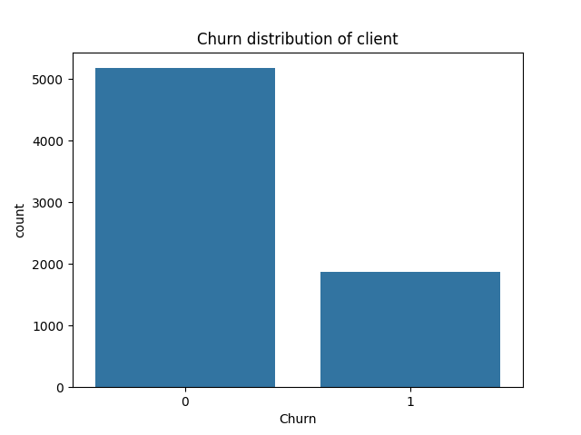
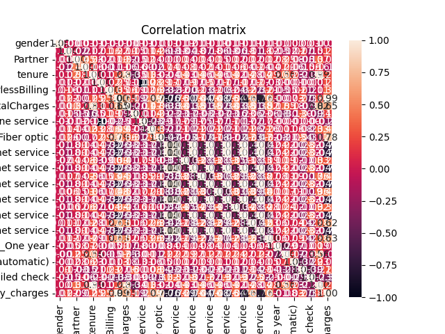

# Telecom Churn Prediction

Проект по предсказанию оттока клиентов телеком-компании с использованием кастомной и sklearn-версии логистической регрессии.

## Содержание
- [Установка](##установка)
- [Структура проекта](##структура проекта)
- [Данные](##данные)
- [Предобработка](##предобработка)
- [Модели](##модели)
- [Результаты](##результаты)
- [Как улучшить?](##Как улучшить?)
- [Лицензия](##Лицензия)

## Установка
1. Клонируйте репозиторий:
   ```bash
   git clone https://github.com/yourusername/telecom_churn.git
   cd telecom_churn
   ```

2. Установите зависимости
   ```bash
   pip install -r requirements.txt
   ```

## Структура проекта
```
telecom_churn/
├── data/                    # Исходные данные
│   └── telecom.csv          
├── src/
│   ├── preprocessing.py     # Предобработка данных
│   ├── custom_model.py      # Кастомная модель
│   ├── original_model.py    # Sklearn-реализация
│   └── main.py              # Точка входа
├── requirements.txt         # Требования
└── README.md
```

## Данные

[Датасет с Kaggle](https://www.kaggle.com/datasets/blastchar/telco-customer-churn) содержит информацию о клиентах телеком-компании:

- Целевая переменная: Churn (1/0)
- Признаки
    - Платежи (Ежемесячные/Общие расходы)
    - Услуги (Интернет, ТВ и т.д.)
    - Демографические (пол, семейное положение и т.д.)
  
## Предобработка

В качестве предобработки данных мною было выполнено:
- Кодирование категориальных данных
- Преобразование object столбцов в численные
- Обработка пустых ячеек
- Анализ и визуализация выбросов
- Добавление новых признаков
- Z-score нормализация данных
- Визуализация распределения churn 


- Построение матрицы корреляций 
 


## Модели

### Кастомная логистическая регрессия
Была реализована с нуля
- Функция логистической регрессии
- Метрики accuracy, precision, recall, f1
- Кросс-валидация
- Реализация подбора параметров в конструкторе класса

### Sklearn логистическая регрессия
Используется для сравнения

## Результаты

| Метрика   | Кастомная | Sklearn  | Кастомная cv | Sklearn cv |
|-----------|-----------|----------|--------------|------------|
| Accuracy  | 0.815472  | 0.743790 | 0.798239     | 0.746557   |
| Precision | 0.694158  | 0.510869 | 0.657624     | 0.514637   |
| Recall    | 0.541555  | 0.816845 | 0.502436     | 0.803987   |
| F1        | 0.608434  | 0.628601 | 0.569282     | 0.627245   |
| ROC-AUC   | 0.727824  | 0.767118 | 0.703725     | 0.764984   |

### Выводы
- В случае если нам нужно гарантированно удержать клиентов, 
используем кастомную модель со стандартным разделением данных,
так как метрика precision именно этой модели показывает
наибольший результат
- Если компания готова предоставлять скидки клиентам, 
которые фактически не уходят (ложноположительные случаи, 
а это 19%), стоит выбрать sklearn-версию модели с высоким 
recall
- Кастомная версия показала лучшие результаты метрик accuracy, 
precision
- Но в целом, лучшие результаты метрик показала sklearn версия со стандартным
сплитом.

## Как улучшить?

- Добавление unit-тестов
- Реализация интерактивного анализа в Jupyter Notebook 
для наглядности
- Добавление модели RandomForest

## Лицензия
Этот проект распространяется под лицензией MIT. Вы можете 
свободно использовать, изменять и распространять его при условии 
сохранения уведомления об авторстве
